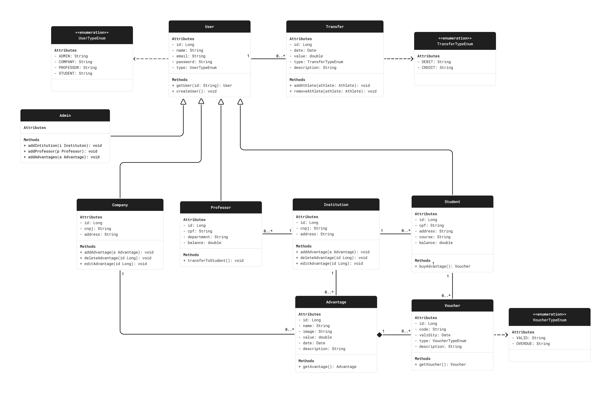

<br>
<h3 align="center">

</h3>
<br>
<p align="center">
 <a href="#MeritCoin"> Introducion </a> •
 <a href="#Group-Members"> Group Members </a> • 
 <a href="#Description"> Description </a> • 
 <a href="#Documentation"> Documentation </a>
</p>

# MeritCoin

Student Currency System to encourage recognition of student merit through virtual currency

## Group Members
* [Gabriel Ramos Ferreira](https://github.com/gramos22)
* [João Pedro Silva Braga](https://github.com/joaopedro-braga)
* [Júlia Moreira Nascimento](https://github.com/JulyaMoreyra)

## Description

This project implements a RESTful API for a Student Coin System, designed to incentivize student engagement and recognize academic achievements through a virtual currency. The system allows professors to award students with coins, which can later be redeemed for rewards and discounts from partner companies.

### Features

- **User Management:** Secure user registration and authentication for students, professors, and partner companies.
- **Coin Distribution:** Professors can award coins to students based on various criteria (participation, performance, etc.).
- **Reward Redemption:** Students can browse and redeem their earned coins for available rewards from partner companies.
- **Transaction History:** A transparent log of all coin transactions for auditing and tracking purposes.
- **Partner Company Management:** Companies can register, manage their offered rewards, and track redemptions.

### Technologies Used - Backend

**Language and Framework:**

- Java 17
- Spring Boot 3
- Spring Data JPA
- Spring Security (JWT)
- PostgreSQL

**Testing:**

- JUnit
- Mockito

**Tools:**

- Maven/Gradle
- Git
- Postman (for API testing)
- Swagger (for API documentation)

### Project Structure

The project follows a layered architecture:

- **API Layer (Controllers):** Handles HTTP requests, validates input, and delegates to the service layer.
- **Service Layer (Business Logic):** Implements business rules, manages transactions, and interacts with repositories.
- **Repository Layer (Data Access):** Provides abstraction over data persistence, using Spring Data JPA to interact with the database.

## Documentation

### User Stories

#### US01
```
As a Student, 
I want to register for the system 
so that I can start earning coins.
```

#### US02
```
As a Student,
I want to receive notifications about earned coins 
so that I can stay informed about my rewards. 
```

#### US03
```
As a Student, 
I want to view my coin transaction history 
so that I can track my coin balance and redemption activity.
```

#### US04
```
As a Student, 
I want to browse and select available rewards 
so that I can choose how to redeem my earned coins.
```

#### US05
```
As a Student, 
I want to redeem coins for rewards 
so that I can take advantage of discounts and benefits.
```

#### US06
```
As a Student, 
I want to log in to the system securely 
so that I can protect my account and personal information. 
```

#### US07
```
As a Professor, 
I want to be pre-registered in the system by my institution 
so that I can easily start awarding coins to students. 
```

#### US08
```
As a Professor, 
I want to view my current coin balance 
so that I can track my available coins for awarding.
```

#### US09
```
As a Professor, 
I want to award coins to students 
so that I can recognize their achievements and contributions. 
```

#### US10
```
As a Professor, 
I want to view my coin transaction history 
so that I can keep track of my coin awards. 
```

#### US11
```
As a Professor, 
I want to log in to the system securely 
so that I can protect my account and access student information responsibly. 
```

#### US12
```
As a Partner Business, 
I want to register my business on the system 
so that I can offer rewards to students and promote my products or services. 
```

#### US13
```
As a Partner Business,
I want to create and manage reward listings 
so that I can control the rewards offered and their associated costs. 
```

#### US14
```
As a Partner Business, 
I want to receive a notification of reward redemption 
so that I can prepare for student redemption and track my reward program's success. 
```

#### US15
```
As a Partner Business, 
I want to log in to the system securely 
so that I can manage my business profile and reward offerings safely. 
```

#### US16
```
As an Educational Institution, 
I want to register and manage my institution's profile 
so that I can participate in the program and manage my institution's information.
```

#### US17
```
As an Admin, 
I want to create, read, update, and delete educational institutions 
so that I can manage the list of participating institutions.
```

#### US18
```
As an Admin, 
I want to create, read, update, and delete professor accounts 
so that I can manage the list of professors within the system.
```

#### US19
```
As an Admin,
I want to create, read, update, and delete advantages
so that I can manage the available rewards for students. 
```

### Use Case Diagram


[Access Figma](https://www.figma.com/board/PYlusaqx1MlFrGw4pPKOVG/Use-Case-Diagram---MeritCoin?node-id=0-1&t=b0egOGcunYcB3nUm-1)

### Class Diagram


[Access Figma](https://www.figma.com/board/gKozuKilj9F7aWZRacTXJz/Class-Diagram---MeritCoin?node-id=0-1&t=opClSieNatKHDaCx-1)

### Package Diagram


[Access Figma](https://www.figma.com/board/YsDL6sZk87p4KRTDTB4FKq/Package-Diagram---MeritCoin?node-id=0-1&t=mur0yCL6oJoVavC3-1)
